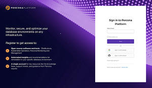

This update adds key enhancements to Percona Platform's integration with PMM, improves the authentication flow, and brings important design and UX refinements.

## Revamped Registration and Log in screen

The first thing you'll notice with this update is the new look-and-feel of the landing page. 
We've leveraged the old minimal design to create a sleek and modern look, that is more aligned with the Percona branding we love. 

In addition, we've simplified the Log in and Registration form, to make it easier for you to connect to your account.

> 

## Enhanced User Experience to boost your productivity
We’ve also tweaked the structure of the main menu to improve the navigation when moving from one flow to another. 

The links to managing existing organizations and connected PMM instances are no longer hidden inside the **Get Started** tab. Instead, they are exposed as dedicated tabs on the main menu: **Organization Management** and **Connect PMM**. 

In addition, the **Get Started** tab has been merged into the **Dasboard** tab, which now hosts all the tools for creating your organization and connecting PMM instances to it. 
You'll also find here information related to your account, as well as links to contact Percona for support, consulting, or managed services. 

You may also want to know that the **Resources** menu now also includes a link to the online Help.

## Federated authentication via social and custom identity providers
Percona Platform now supports authentication via external identity providers for a seamless, more fluid authentication flow.

As an alternative to connecting with a Percona Account username and password, you can now also sign in and register with a Google, GitHub, or any custom identity provider. 

To configure and enable custom identity provider for your account, contact [Percona Support](https://www.percona.com/about-percona/contact).

## Enhanced integration with PMM
With this update, we are improving PMM connections to Percona Platform with:

- token-based connections to support federated authentication and increase security 
- synchronized customer account information across PMM and Percona Platform

### PMM instances now connected via access token
To accommodate federated authentication, Percona Platform now requires PMM instances to connect via access-token authorization. 

As a result, PMM 2.27 updated the **Connect PMM to Percona Portal** workflow to replace username and password authentication with access-token authorization. 

To check out the new token-based authentication, go to **PMM > Settings > Percona Platform** and click **Get token from Percona Platform** next to the **Percona Platform Access Token** field.

For more information, see [Connect your PMM server](connect-pmm.md).

### Synchronized customer information with PMM 
After connecting PMM to Percona Platform as a Percona customer, PMM now reveals two new tabs on the main menu: **Entitlements** and **Support tickets**. 
 
Percona Platform populates these tabs with information related to their Percona Platform entitlements and Customer Support cases.

For more information, see [Integrate PMM with Percona Platform](https://www.percona.com/doc/percona-monitoring-and-management/2.x/how-to/integrate-platform.html) in the PMM online Help.