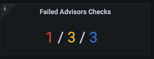

Percona Monitoring and Management (PMM) includes a set of Advisors that run checks against the databases connected to PMM. The checks identify and alert you of potential security threats, performance degradation, data loss, data corruption, non-compliance issues, etc.

## Prerequisites for accessing Advisor checks

All checks are hosted on Percona Platform. PMM Server automatically downloads them from here when the **Advisors** and **Telemetry** options are enabled in PMM under **Configuration > Settings > Advanced Settings**. Both options are enabled by default.

## Advisor check tiers and entitlements

Depending on the entitlements available for your Percona Account, the set of advisor checks that PMM can download from Percona Platform differ in terms of complexity and functionality.

If your PMM instance is not connected to Percona Platform, PMM can only download the basic set of Anonymous advisor checks.
As soon as you connect your PMM instance to Percona Platform, has access to additional checks, available only for Registered PMM instances.

If you are a Percona customer with a Percona Customer Portal account, you also get access to Paid checks, which offer more advanced database health information.

## Checks results

The checks can be executed manually or automatically. Manual checks can be executed individually, or all together. 

Automatic checks run every 24 hours by default. You can configure this interval in **PMM > Advanced Settings > Execution intervals** by changing the label interval for each check, or by changing the default intervals to custom ones:

-  **Standard**- 24 hours
-  **Rare** - 78 hours
-  **Frequent** - 4 hours

The results are sent to PMM Server where you can review any failed checks on the **Home Dashboard > Failed Advisor Checks** panel. The summary count of failed checks is classified as <b style="color:#e02f44;">Critical</b>, <b style="color:#e36526;">Major</b> and <b style="color:#5794f2;">Trivial</b>:

Check results data always remains on the PMM Server and are not related to anonymous data sent for Telemetry purposes.

For information on configuring PMM Advisors, see the [Percona Monitoring and Management documentation](https://www.percona.com/doc/percona-monitoring-and-management/2.x/how-to/advisors.html).

## List of checks

Percona Platform hosts all Advisor checks for MySQL, MongoDB, and PostgreSQL databases connected to PMM. Check the complete list of checks and their availability for **anonymous**, **registered**, and **paid** PMM instances in the tables below.

### MySQL checks

| Check Name | Description | Tier |
| :--------- | :---------- | :--- |
| **Check if Binaries are 32-bits** | Notifies if version_compatible_machine equals i686. | Registered, Paid |
| **MySQL Automatic User Expired Password** | Warns if MySQL automatic password expiry is not active. | Paid |
| **MySQL InnoDB flush method and File Format check** | Checks the following settings: **innodb_file_format**, **innodb_file_format_max**, **innodb_flush_method** and **innodb_data_file_path** | Paid |
| **MySQL Checks based on values of MySQL configuration variables** | Checks the following settings: **sync_binlog**, **log_bin, general_log**, **tmp_table_size**, **sql_mode**, **read_only**. | Registered,Paid |
| **MySQL Checks based on values of MySQL replication configuration variables** | Warns if replication is not configured correctly. | Registered,Paid |
| **MySQL Binary Logs checks, Local infile and SQL Mode checks** | Warns about non-optimal settings for Binary Log, Local Infile and SQL mode. | Registered, Paid |
| **MySQL Configuration Check** | Warns if parameters not following Percona best practices, for infile, replication threads and replica checksum. | Registered, Paid |
| **MySQL InnoDB password lifetime** | Warns about password lifetime. | Registered, Paid |
| **MySQL InnoDB Strict Mode** | Warns if InnoDB strict mode is disabled, which could compromise data integrity. | Paid |
| **MySQL index sizes** | Warns if any have indexes larger than data.  This indicates sub-optimial schema and should be reviewed. | Paid |
| **MySQL replication configuration check** |  Checks if a replica is safely logging replicated transactions.| Paid |
| **MySQL Users With Granted Public Networks Access** | Notifies about MySQL accounts allowed to be connected from public networks. | Paid |
| **MySQL Secure Transport** | Warns if MySQL server allows unencrypted remote connections. | Registered, Paid |
| **MySQL User Check** | Runs a high-level check on user setup | Registered |
| **MySQL Advanced User Check** | Runs a detailed check on user setup | Paid |
| **MySQL Security Check for password policy** | Runs advisor checks on password policy. | Paid |
| **MySQL Security Check for remplication** | Runs advisor checks on replica account. | Paid |
| **MySQL Replication privileges** | Warns if replication privileges is mixed with more elevated privileges. | Paid |
| **MySQL tables without Primary Key** | Warns if  tables added without primary keys. | Paid |
| **MySQL Test Database** | This check returns a notice if there is database with name ‘test’ or ‘test\_%’. | Registered, Paid |
| **MySQL Timezone** | Checks if time zone is correctly loaded. | Registered, Paid |
| **MySQL Version** | Warns if MySQL, Percona Server for MySQL, or MariaDB version is not the latest one. | Anonymous, Registered, Paid |

### MongoDB checks

| Check Name | Description | Tier |
| :--------- | :---------- | :--- |
| **MongoDB Active vs Available Connections** | Checks the ratio between Active and Available connections. | Registered, Paid |
| **MongoDB Authentication** | Warns if MongoDB authentication is disabled. | Registered, Paid |
| **MongoDB Security AuthMech** | Warns if MongoDB is not using the default SHA-256 hashing as SCRAM authentication method. | Registered, Paid |
| **MonogDB IP Bindings** | Warns if MongoDB network binding is not set as recommended. | Paid |
| **MonogDB CPU cores** | Warns if the number of CPU cores does not meet the minimum recommended requirements according to best practices. | Registered, Paid |
| **MongoDB CVE Version** | Shows an error if MongoDB or Percona Server for MongoDB version is not the latest one with CVE fixes. | Anonymous, Registered, Paid |
| **MongoDB Journal Check** | Warns if journal is disabled. | Registered, Paid |
| **MongoDB Localhost Authentication Bypass is Enabled** | Warns if MongoDB localhost bypass is enabled. |  Paid |
| **MongoDB Non-Default Log Level** | Warns if MongoDB is not using the default log level. | Registered, Paid |
| **MongoDB maxSessions** | Warns if MongoDB is using more maxSessions value other than the default one | Registered, Paid |
| **MongoDB Read Tickets** | Warns if MongoDB is using more than 128 read tickets. | Registered, Paid |
| **MongoDB Replica Set Topology** | Warns if the Replica Set cluster has less than three members. | Paid |
| **MongoDB TaskExecutorPoolSize High** | Warns if MongoDB TaskExecutorPoolSize count is higher than available CPU cores. | Registered, Paid |
| **MongoDB Version** | Warns if MongoDB or Percona Server for MongoDB version is not the latest one. | Anonymous, Registered, Paid |
| **MongoDB Write Tickets** | Warns if MongoDB network is using more than 128 write tickets. | Registered, Paid |
| **MongoDB Configuration Write Tickets** | Warns if MongoDB is using more than 128 write tickets during runtime. | Registered, Paid |

### PostgreSQL checks

| Check Name | Description | Tier |
| :--------- | :---------- | :--- |
| **PostgreSQL Archiver is Failing** | Verifies if the archiver has failed. | Registered, Paid |
| **PostgreSQL Cache Hit Ratio** | Checks database hit ratio and complains when this is too low. | Registered, Paid |
| **PostgreSQL Configuration Change Requires Restart/Reload** | Warns when a configuration was changed and requires a server restart/reload | Registered, Paid |
| **PostgreSQL fsync is Disabled** | Shows an error if the fsync configuration is disabled, as this can result in unrecoverable data corruption. | Anonymous, Registered, Paid |
| **PostgreSQL Autovacuum Logging Is Disabled** | This check returns a notice if the **log_autovacuum_min_duration** configuration option is set to -1 (disabled). | Paid |
| **PostgreSQL Checkpoints Logging Is Disabled** | Notifies if the **log_checkpoints **configuration option is not enabled. | Registered, Paid |
| **PostgreSQL Max_connections is too high** | Notifies if the max_connections setting is set above 300. | Paid |
| **PostgreSQL Stale Replication Slot** | Warns for stale replication slots since these can lead to WAL file accumulation and DB server outage. | Paid |
| **PostgreSQL Super Role** | Notifies if there are users with superuser privileges. |  Paid |
| **PostgreSQL autovacuum settings** | Notifies if autovacuum paramters are specified along with autovacuum settings  |  Paid |
| **PostgreSQL Table Bloat size** | Notifies if there is any table with a bloat larger than 1GB and this is at least the 20% of the table total size. |  Registered, Paid |
| **PostgreSQL Table Bloat in percentage of the table size** | Notifies if there is any table with a bloat larger than 1GB and this is at least the 50% of the table total size. |  Registered, Paid |
| **PostgreSQL Transaction ID Wraparound approaching** | Notifies if all the databases txid age and notifies if any is approaching to the wraparound limit. |  Registered, Paid |
| **PostgreSQL Version Check** | Warns if the PostgreSQL minor or major versions are not the latest, and shows an error if the major version is 9.4 or older. | Anonymous, Registered, Paid |
