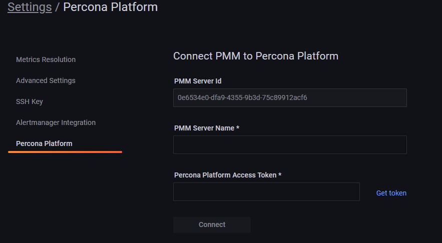

Percona Monitoring and Management (PMM) is a best-of-breed open source database monitoring solution for MySQL, MongoDB, PostgreSQL, and MariaDB databases.

Connect your PMM servers to Percona Platform to leverage Platform services that boost the monitoring capabilities of your PMM installations.

## Pre-requisites

To ensure that Percona Platform can establish a connection with the PMM instance:

### Install PMM 2.27.0 or later

Before connecting your PMM server to Percona Platform, make sure you are using PMM version 2.27 or newer. Otherwise, upgrade your PMM installation beforehand.

Upgrading is required because PMM 2.25 and 2.26 use username/password authentication for connecting to Percona Platform. Starting with PMM 2.27, this was replaced with access token authentication to support federated identity and increase security.

This change did not affect existing connections to PMM Platform, which were not automatically terminated.

For more information, see [Install and set up PMM](https://www.percona.com/doc/percona-monitoring-and-management/2.x/setting-up/index.html).

### Set the public address of your PMM server

1. Log into PMM and go to **PMM > Settings > Advanced Settings**.
2. Enter your address/hostname or click **Get from browser** to enable your browser to automatically detect and populate this field.
3. Save the changes.

### Check that you are a member of an existing organization

1. Log in to [Percona Platform](https://portal.percona.com).

!!! hint alert alert-success "Tip"
   If you are connecting via GitHub, make sure that you set your email address as **public** in your GitHub account. Otherwise, Percona Platform cannot access it to authenticate you.

2. On the **Getting Started page**, check that the **Create organization** step shows an option to view your organization.  

   If you see an option to create a new organization instead, your Percona Account is not linked to any organization yet. In this case, contact your account administrator, or create a new organization for your Percona Account.

## Connect PMM to Percona Platform

To connect your PMM server to Percona Platform, generate a personal access token from Platform and paste it into PMM:

1. Log in to PMM and go to **PMM > Settings > Percona Platform** tab to fill in the **Connect PMM to Percona Platform** form.

   

2. The **PMM server ID** field is automatically populated with the ID identified for your PMM instance. Enter the name of your PMM instance and click **Get token** to go to Percona Platform Portal and generate your access token.
3. Log into Percona Platform using your Percona Account (if you don't have an active current session).
4. On the Profile Settings page, copy the code from the **Percona Platform Access Token** field.
   For security reasons, the access token expires after 30 minutes. Make sure to paste the code in PMM before that, or generate a new token if it expires.
5. Back into PMM, paste the Access Token into the **Percona Platform Access Token** field and click **Connect**.

To confirm that you have successfully connected the server and check the list of all servers currently connected to an organization, go to [Percona Platform](https://portal.percona.com) **> PMM Instances**. 

### Disconnect a PMM instance

Disconnect a PMM instance when you want to unlink it from your Percona Platform organization or stop monitoring it there.

To disconnect a PMM server, go to > <i class="uil uil-cog"></i> **Configuration > Settings > Percona Platform** and click **Disconnect**.

To confirm that the server disconnected successfully, go to Percona Platform > **View instances**. This displays the **PMM instances** page where you can check the list of servers currently connected to your Platform organization.

### Remove entries from the list of connected PMM instances
If you want to remove a PMM server from the list of connected PMM instances without disconnecting it from Percona Platform, go to go to [Percona Platform](https://portal.percona.com) ** > View Instances** and click the Remove icon  next to the server you want to remove from the list.

You may want remove servers from the list when you have lingering servers that Percona Platform can no longer reach because they lost internet connection. 

## Sign into PMM with your Percona Account

Once you've connected your PMM instance to Percona Platform, you can use your Percona Account to sign in to PMM:

1. Log out of your existing PMM session.

2. On the PMM Log in screen, click the **Sign in with Percona Account**.  
   If you have an active Percona Account session on the same browser, PMM will log you in automatically. Otherwise, enter your Percona Account credentials to start a new session.
