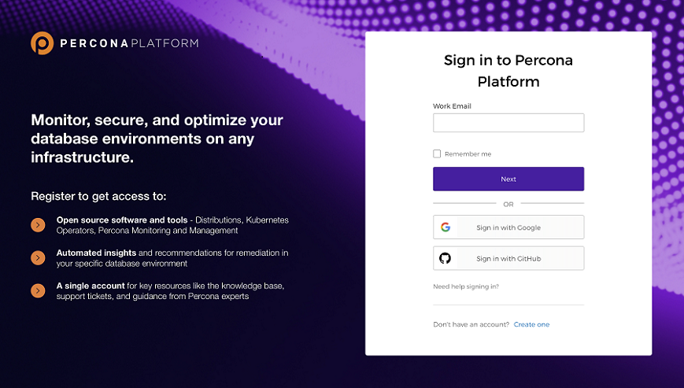

## General Availability

We're excited to announce that Percona Platform is generally available and ready to use in production!

This update adds key enhancements to Percona Platform’s integration with PMM, improves the authentication flow, and brings important design and UX refinements.

## Revamped Registration and Log in screen

The first thing you'll notice with this update is the new look-and-feel of the landing page.
We overhauled the old minimal design to create a sleek and modern look, that is more aligned with the Percona branding we love.

In addition, we've simplified the Login and Registration flow, to make it easier for you to connect to your account.

## Federated authentication via social and custom identity providers

Percona Platform now supports authentication via external identity providers for a seamless, more fluid authentication flow.

As an alternative to connecting with a Percona Account username and password, you can now also sign in and register with a Google, GitHub, or any custom identity provider. For GitHub, make sure that your email address is set to public so that Percona Platform can use it during authentication.

To configure and enable a custom identity provider for your account, contact [Percona Support](https://www.percona.com/about-percona/contact).

## Enhanced integration with Percona Monitoring and Management (PMM)

This update also enhances PMM connections to Percona Platform with:

- token-based connections to increase security and support federated authentication
- synchronized customer account information across PMM and Percona Platform
- new Advisor checks for Registered and Paid Tier

### PMM instances now connected via access token

To accommodate federated authentication, Percona Platform now requires PMM instances to connect via access-token authorization.

As a result, PMM 2.27 updated the **Connect PMM to Percona Platform** workflow to replace username and password authentication with access-token authorization.

PMM instances that are already connected to Percona Platform will not be affected by this update. However, we recommend that you disconnect all existing PMM instances and reconnect them using the new access-token authorization.

To check out the new token-based authentication, go to **PMM > Settings > Percona Platform** and click **Get token from Percona Platform** next to the **Percona Platform Access Token** field.

For more information, see [Connect your PMM server](connect-pmm.md).

### Synchronized customer information with PMM

After connecting PMM to Percona Platform as a Percona customer, PMM now reveals two new tabs on the main menu: **Entitlements** and **Support tickets**.

Percona Platform populates these tabs with information related to their Percona Platform entitlements and Customer Support cases.

For more information, see [Integrate PMM with Percona Platform](https://www.percona.com/doc/percona-monitoring-and-management/2.x/how-to/integrate-platform.html) in the PMM online Help.

### New Paid tier and special PMM Advisor checks for customers

When you connect your PMM to Pecona Platform with an account linked to Percona Customer Portal, you will get access to Paid Advisor checks in addition to Registered checks.
Paid Advisor checks offer more advanced information about the health of your databases.

Here are the new list of checks introduced with this update:

**New MySQL Advisor Checks**

- Validate Password Policy
- Local Option of Load Data Enabled
- Not Verifying Checksum
- SQL Processing Not Multi-Threaded

**New MongoDB Advisor Checks**

- Check the Replica Set Topology
- Check Active/Available Connection Ratio

See the full list of database checks in the [Advisor checks for PMM](../advisors.md) topic.

## Enhanced User Experience to boost your productivity

We’ve also tweaked the structure of the main menu to improve the navigation when moving from one flow to another.

The links to managing existing organizations and connected PMM instances are no longer hidden inside the **Get Started** tab. Instead, they are exposed as dedicated tabs on the main menu: **Organization** and **PMM Instances**.

In addition, the **Get Started** tab has been merged into the **Dashboard** tab, which now hosts all the tools for creating your organization and connecting PMM instances to it.
You'll also find here information related to your account, as well as links to contact Percona for support, consulting, or managed services.

The **Resources** menu now also includes a link to this online Help, so that you can reach this space any time from within Platform Portal.
