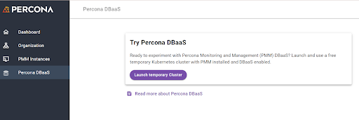

## Test-drive PMM from within Percona Platform

We’ve replaced the previous **Free Kubernetes** feature with an option to generate a full-fledged PMM environment.

The new **Try Percona Monitoring and Management (PMM)** option in Percona Platform creates fully configured K8 clusters, automatically provisioned with a PMM server, for which the DBaaS feature is already enabled. 

This read-to-go environment enable you to spend the three available test hours monitoring your temporary DB cluster and evaluating all the benefits of Percona DBaaS. No kubeconfig files to register, no PMM server to provision, no fuss, no mess. 

[SS here]

For more information, see [Launch PMM environment](../launch_PMM.md).