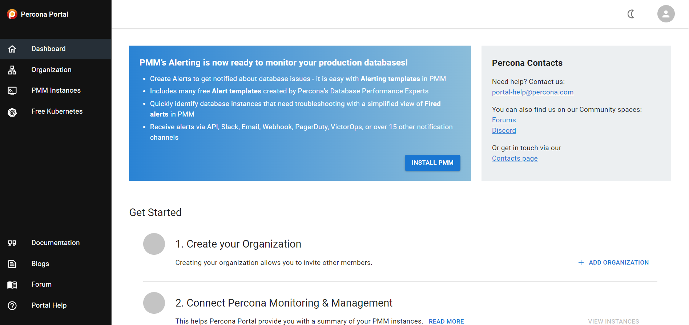

## Percona Platform Portal powered by MUI
When you [sign into Percona Platform](https://portal.percona.com), you'll see that the general look-and-feel is slightly different.

This is the result of what we've been working on lately. We stopped using the Grafana UI library and migrated over to MUI (Material UI).

This is only the first phase of a more ambitious initiative, led by our amazing Design team, which involves overhauling the general user experience for Percona Platform Portal.

During this first phase we focused on migrating over to the new UI library, while the next phase will bring redesign elements (i.e. better UX).

This change gives us a much better foundation to continue building and growing the Percona Platform Portal on.

## Improved handling of invalid account activation links 

We're now showing a more meaningful message for attempts to activate a Percona Account from a link that contains an expired token.