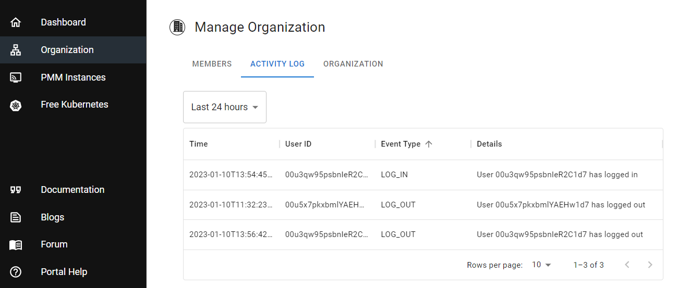
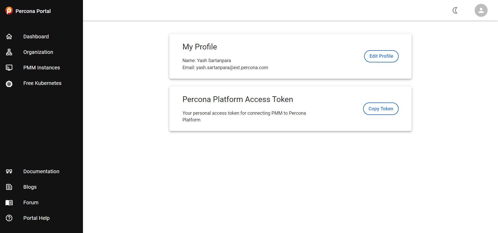

## Authentication monitoring for organizations

The Activity Logging feature introduced in the previous update has been enhanced to include information about user authentication flows.

In addition to the existing logs about organization activity, Percona Platform now also records the following user authentication activity events:

- User Log in
- User Log out
- Changed passwords

This information enables organization administrators to better analyze the activity of their organization members for security and audit purposes.

To check out the changes, go to **Organization > Activity Log**, and review your recent organization activity. 

## UX improvements to the User Profile page

We’ve improved the design of the User profile page and moved things around to make essential actions easier to find and understand. 

To see how we did, click on your user icon on the right-hand side of the screen, then click **Profile**.

## Bug fixes

- Improved text in auto-generated emails to clarify that registration emails are sent by Percona Platform.
- Fixed broken link to PMM documentation on the **Free Kubernetes Cluster** page.
- Fixed timeout issue that was generating multiple popup error messages when returning to an expired Percona Platform user session. 
  
Percona Platform now prompts you to log in again instead of displaying the “An error occurred while requesting data” message.
