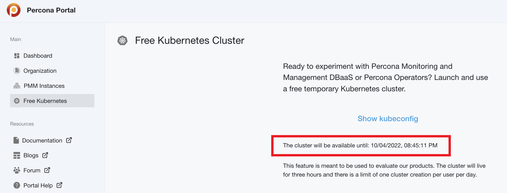
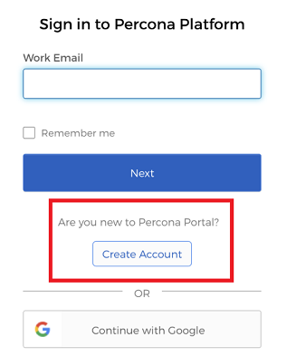

## Expiration time for Kubernetes clusters
The previous Percona Platform update has introduced the option to spin up temporary Kubernetes clusters for testing PMM with DBaaS and Percona Operators. 

With this update, we are now adding a timestamp on the **Kubernetes** page showing the time left before the current three-hour cluster expires:  

## Updated Dashboard page with information about Percona Alerting

The latest PMM release introduces an improved Alerting system, powered by Grafana’s advanced alerting capabilities. 

If you haven't upgraded to PMM 2.31 yet, you'll find an **Install** link on the **Dashboard** page, along with a list of alerting improvements available in this new PMM version. 

## List of required ports for locked-down environments

If you are running PMM in a locked-down corporate environment without direct access to the Internet, you may find useful the new [Network configuration topic](https://docs.percona.com/percona-platform/network.html) in the online Help.

## Various UX enhancements 

We have made some minor changes to key pages and workflows in Percona Portal:

- Highlighted and improved option to create a new Percona Platform account. Users who don't yet have an account can now register quicker via the **Are you new to Percona Portal? Create Account** option on the [Login](https://portal.percona.com/login) page. 
  
     

- Users invited to join an organization can now activate their new Percona Platform account via the new **Account Activation** page. 

    This page is adapted to the specific workflow of activating an account via an organization invite, instead of redirecting to the general **Create a new account** page.  
      

- The **List of tickets opened** on the Dashboard page now includes default sorting by ticket number. 
   This ensures that you always see the most recent tickets first. 
     

- Enhanced the **Delete organization** confirmation dialog box to highlight the consequences of this irreversible action better. 
    

